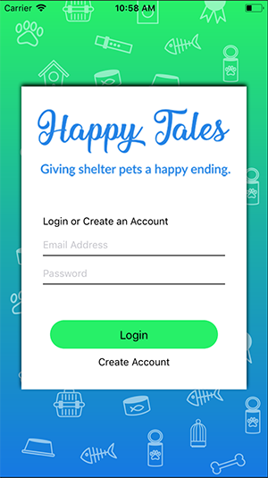
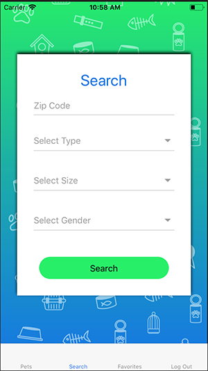
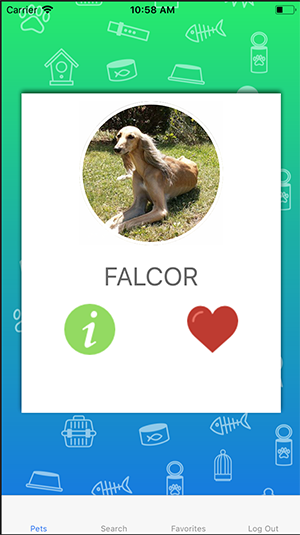
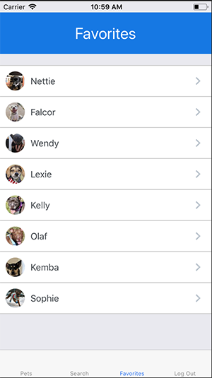

# Happy Tales

Happy Tales is a mobile app made with React Native that connects shelter pets to furever homes because everyone should have a pet in their life, and every pet should have a human.

## Built With

* [React Native](https://facebook.github.io/react-native/)
* [Firebase](https://firebase.google.com/)
* [React Native Router Flux](https://github.com/aksonov/react-native-router-flux)
* [React Native Elements](https://react-native-training.github.io/react-native-elements/)
* [Expo](https://expo.io/)

## Links

* [Live Demo](https://youtu.be/r1HFjOnVuPY)

## Images

## Built By

* **Chelcie Britt** - (https://github.com/chelciebritt)

## License

This project is licensed under the MIT License - see the [LICENSE.md](LICENSE.md) file for details
